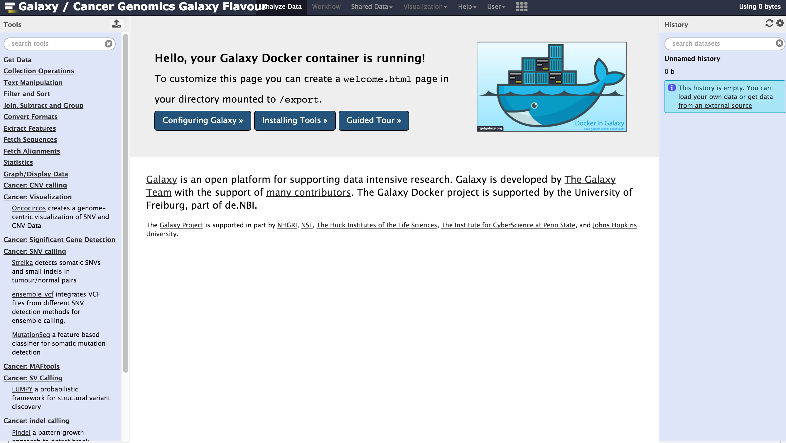
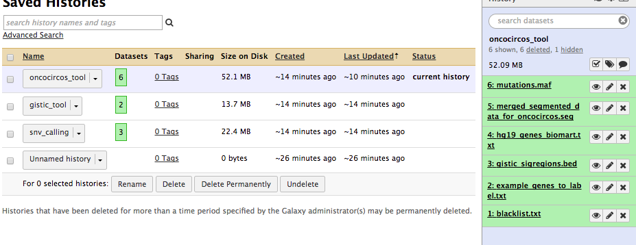

# Using the Docker Cancer Genomics Galaxy flavor



##Background
The Dockerfile provided here should allow you to build your own image based on the extremely useful [Galaxy-stable Docker image](https://github.com/bgruening/docker-galaxy-stable) maintained by Björn Grüning. The build process can be lengthy because it involves installing some of the additional dependencies needed by various tools in the Cancer Genomics toolkit. Currently, not all of the tools we have released are included in this Dockerfile but we plan to include as many as possible if there is sufficient interest. We also invite the community to contribute derivatives with any missing tools or additional tools that integrate well into the goals of this project. 

##Using a pre-built image
The latest build of this has been submitted to [Docker Hub](https://hub.docker.com/r/morinlab/cancergenomicsgalaxy/). Feel free to run the image directly or build your own using the steps below. The image in Docker Hub may not be as up-to-date as some tools are being actively developed. 

##Building your own image
Assuming you have installed Docker properly on the system you wish to build the image, the process should be quite simple. In the directory containing both the Dockerfile and tool list, run the following command:

```docker build -t full_galaxy_can .```

###If you succeed:
After a successful build, you should see an output similar to the following:
<pre>
Activating virtualenv at /galaxy_venv
Galaxy is running.
(1/18) Installing tool ensembl_vep from morinlab to section "Cancer: Variant Annotation" at revision ba310f592561 (TRT: 0:00:00.439323)
        Tool ensembl_vep installed successfully (in 0:16:57.118123) at revision ba310f592561
(2/18) Installing tool oncocircos from morinlab to section "Cancer: Visualization" at revision 417f984cd2e2 (TRT: 0:16:57.867164)
        Tool oncocircos installed successfully (in 0:03:52.541461) at revision 417f984cd2e2
(3/18) Installing tool oncodrivefm from morinlab to section "Cancer: Significant Gene Detection" at revision 97e99acadbaf (TRT: 0:20:50.717781)
        Tool oncodrivefm installed successfully (in 0:08:07.993747) at revision 97e99acadbaf
(4/18) Installing tool sequenza from morinlab to section "Cancer: CNV calling" at revision 73338a1805e7 (TRT: 0:28:59.025247)
        Tool sequenza installed successfully (in 0:23:32.252223) at revision 73338a1805e7
(5/18) Installing tool strelka from morinlab to section "Cancer: SNV calling" at revision 3ce78c04c7e5 (TRT: 0:52:31.587923)
        Tool strelka installed successfully (in 0:04:41.765479) at revision 3ce78c04c7e5
(6/18) Installing tool maftools from morinlab to section "Cancer: MAFtools" at revision a67d4b423594 (TRT: 0:57:13.736114)
        Tool maftools installed successfully (in 0:00:05.993371) at revision a67d4b423594
(7/18) Installing tool package_maf2tdm_1_0 from morinlab to section "Cancer: Significant Gene Detection" at revision fd09386ad95f (TRT: 0:57:20.038738)
        Tool package_maf2tdm_1_0 installed successfully (in 0:10:51.696218) at revision fd09386ad95f
(8/18) Installing tool ensemble_vcf from morinlab to section "Cancer: SNV Calling" at revision 19cfeecca08b (TRT: 1:08:12.043805)
        Tool ensemble_vcf installed successfully (in 0:03:19.228229) at revision 19cfeecca08b
(9/18) Installing tool gistic from morinlab to section "Cancer: Significant Gene Detection" at revision da03207b002d (TRT: 1:11:31.585137)
        Tool gistic installed successfully (in 0:07:10.629498) at revision da03207b002d
(10/18) Installing tool igv2gistic from morinlab to section "Cancer: Significant Gene Detection" at revision 1dc70385aba7 (TRT: 1:18:42.522601)
        Tool igv2gistic installed successfully (in 0:00:15.815055) at revision 1dc70385aba7
(11/18) Installing tool mutationseq from morinlab to section "Cancer: SNV Calling" at revision 3f5545f5f0c8 (TRT: 1:18:58.728858)
        Tool mutationseq installed successfully (in 0:02:56.812376) at revision 3f5545f5f0c8
(12/18) Installing tool lumpy from morinlab to section "Cancer: SV Calling" at revision f2d9c9f18d3f (TRT: 1:21:55.870428)
        Tool lumpy installed successfully (in 0:10:17.016338) at revision f2d9c9f18d3f
(13/18) Installing tool mutsigcv from morinlab to section "Cancer: Significant Gene Detection" at revision 9d55e8e75236 (TRT: 1:32:13.197235)
        Tool mutsigcv installed successfully (in 0:11:49.741046) at revision 9d55e8e75236
(14/18) Installing tool pindel from morinlab to section "Cancer: indel calling" at revision 7f2f81f3644f (TRT: 1:44:03.316686)
        Tool pindel installed successfully (in 0:02:44.139814) at revision 7f2f81f3644f
(15/18) Installing tool select_optimal_cluster from morinlab to section "Cancer: CNV calling" at revision 7edf4d48a350 (TRT: 1:46:47.771198)
        Tool select_optimal_cluster installed successfully (in 0:00:38.648014) at revision 7edf4d48a350
(16/18) Installing tool titan from morinlab to section "Cancer: CNV calling" at revision 2f57a1c16d15 (TRT: 1:47:26.733130)
        Tool titan installed successfully (in 0:01:22.118254) at revision 2f57a1c16d15
(17/18) Installing tool transform_vcf_to_counts from morinlab to section "Cancer: CNV calling" at revision 0d9ef2618d9c (TRT: 1:48:49.251443)
        Tool transform_vcf_to_counts installed successfully (in 0:00:22.958821) at revision 0d9ef2618d9c
(18/18) Installing tool vcf2maf from morinlab to section "Cancer: Variant Annotation" at revision dc2f1d630db4 (TRT: 1:49:12.595960)
        Tool vcf2maf installed successfully (in 0:00:17.729001) at revision dc2f1d630db4
Installed tools (18): [('ensembl_vep', None), ('oncocircos', None), ('oncodrivefm', None), ('sequenza', None), ('strelka', None), ('maftools', None), ('package_maf2tdm_1_0', None), ('ensemble_vcf', None), ('gistic', None), ('igv2gistic', None), ('mutationseq', None), ('lumpy', None), ('mutsigcv', None), ('pindel', None), ('select_optimal_cluster', None), ('titan', None), ('transform_vcf_to_counts', None), ('vcf2maf', None)]
Skipped tools (0): []
Errored tools (0): []
All tools have been processed.
Total run time: 1:49:30.325838
</pre>

The latest Dockerfile also should install several workflows that give example use cases for these tools. We have noticed that the last few steps seem to cause problems on fresh builds. If you encounter an issue at the workflow installation step, this can be safely removed from the Dockerfile. 

##Testing your Image
To boot your newly build Docker image, use the following command, substituting the name argument with whatever you choose.

```docker run --name test_image -p 8080:80 full_galaxy_can```

If successful, you should be able to access your Galaxy instance on port 8080  (in this example) on the server running Docker. Unless you change the Dockerfile, which is highly recommended that you do for security reasons, you will be able to log in as admin using "admin" as your password. 

##Testing out the tools and workflows
The Dockerfile adds a script to the image that should allow you to automatically pull in data from a URL for testing the image. To create new histories in your running image, use the commands in the file 'run_after.exec'. The commands in this file look like this:

<pre>docker exec -it $IMAGE_NAME sh -c 'python $GALAXY_ROOT/create_and_upload_history.py snv_calling https://github.com/morinlab/tools-morinlab/raw/master/test-data/strelka_test_data/test.tumour.bam https://github.com/morinlab/tools-morinlab/raw/master/test-data/strelka_test_data/test.normal.bam https://github.com/morinlab/tools-morinlab/raw/master/test-data/strelka_test_data/test.fa'
docker exec -it $IMAGE_NAME sh -c 'python $GALAXY_ROOT/create_and_upload_history.py gistic_tool https://github.com/morinlab/tools-morinlab/raw/master/test-data/gistic_test_data/gistic_input_segments_preprocessed.txt https://github.com/morinlab/tools-morinlab/raw/master/test-data/gistic_test_data/gistic_marker_file.txt.gz'
docker exec -it $IMAGE_NAME sh -c 'python $GALAXY_ROOT/create_and_upload_history.py oncocircos_tool https://github.com/morinlab/tools-morinlab/raw/master/test-data/oncocircos_test_data/blacklist.txt https://github.com/morinlab/tools-morinlab/raw/master/test-data/oncocircos_test_data/example_genes_to_label.txt https://github.com/morinlab/tools-morinlab/raw/master/test-data/oncocircos_test_data/gistic_sigregions.bed https://github.com/morinlab/tools-morinlab/raw/master/test-data/oncocircos_test_data/hg19_genes_biomart.txt https://github.com/morinlab/tools-morinlab/raw/master/test-data/oncocircos_test_data/merged_segmented_data_for_oncocircos.seg https://github.com/morinlab/tools-morinlab/raw/master/test-data/oncocircos_test_data/mutations.maf.gz'</pre>

*Before you run these*, set an environment variable for your image name:

```export $IMAGE_NAME=test_image``` 

test_image in the above example should match what your running container is named. You can confirm the name using:

```docker ps```

If you then run the commands in this file, you should be able to see the new histories in your "saved histories" list. This script is currently submitting as the admin user and this will need to be modified if you change the user and authentication.



## Testing it out on some larger data sets
There are some excellent data sets available from the ICGC-TCGA DREAM challenges that are useful for testing out some of the tools. We recommend (especially if you are already using Google cloud) to try out some of the data sets provided by this group. For example, refer to [this documentation](https://www.synapse.org/#!Synapse:syn312572/wiki/61863) to obtain the synthetic data for the somatic SNV calling challenge.

## Get started working with real data
The test data provided with this release is synthetic and well below the size of real human exome data. The human reference sequences are also not packaged with this release. References files appropriate for your project can be added to (and/or built) within Galaxy using data managers. These data managers can be installed from the main tool shed. To test the image on real human exome data, we suggest you obtain one or more of the exome pairs from Baylor described [here](http://www.nature.com/articles/sdata201610).

You can either download these datasets directly to Galaxy via FTP or (assuming you have them locally on the host machine running your Docker container), you can run the following command to export the local directory containing those bams. In this example, the bams are stored in ~/data.

```docker run -p 8080:80 -v ~/data/:/imported_data full_galaxy_can```
