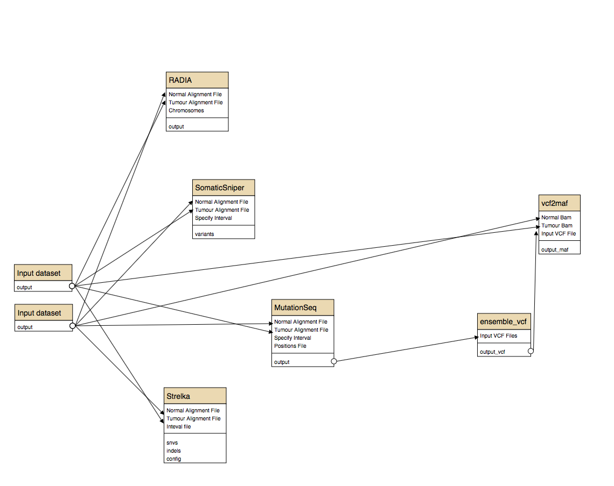
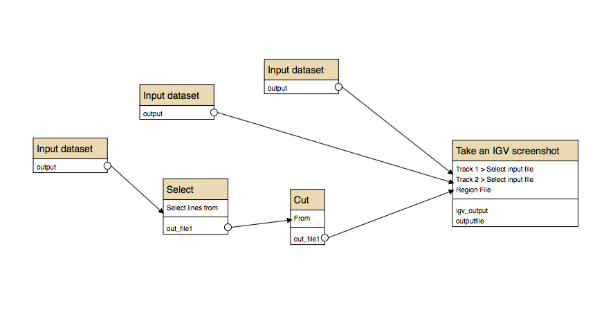
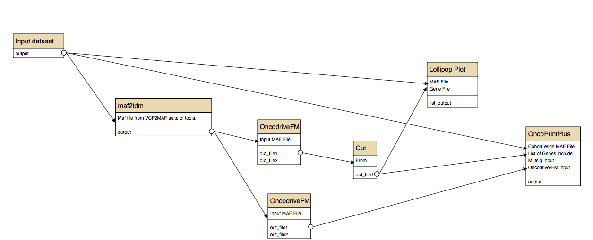
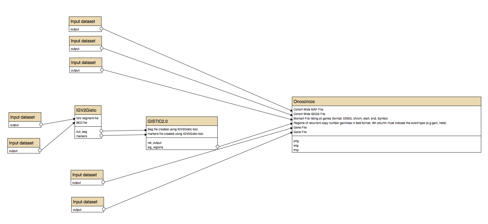
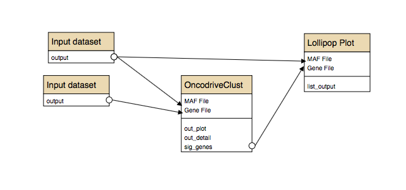

# Cancer Genomics Workflows
These are some example workflows that will get you started using the Cancer Genomics Toolkit
For details, the full toolkit is described [here](http://biorxiv.org/content/early/2016/11/26/089631)

###Calling somatic SNVs using an ensemble approach

###Taking a batch of screenshots in IGV for variants affecting specific loci

###Using OncodriveFM to detect significantly mutated genes and visualizations

###Running GISTIC on CNV results and generating Oncocircos visualization

###Running OncodriveClust and Visualizing Mutations in Lollipop Plots
